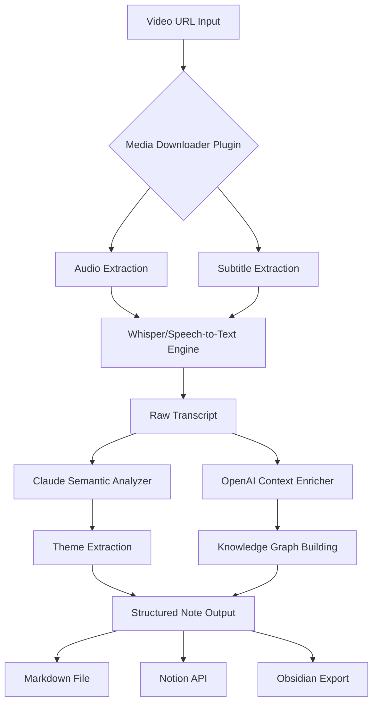

# TranscripTube AI: Smart Video Intelligence & Semantic Transcription Engine

[](https://opensource.org/licenses/MIT)
[](https://denis5u.github.io/reel-mind-map/)
[](https://python.org)
[](https://openai.com)

---

## 🧠 What Is TranscripTube AI? (And Why It Changes the Game)

Imagine having a pair of X-ray glasses for video content. You don't just watch a 45-minute lecture, a cryptic coding tutorial, or a dense documentary—you *see* its skeleton, its DNA, its meaning compressed into actionable intelligence. That is TranscripTube.

TranscripTube AI is a **semantic video summarization engine** that transforms raw video streams into structured, searchable, and actionable notes. It bypasses the linear playback trap. Instead of consuming time, it consumes *signal*. Built on the shoulders of giants like Claude's semantic reasoning and OpenAI's whisper architecture, this tool is designed for researchers, developers, and lifelong learners who refuse to let video content dictate their schedule.

**Watch less. Understand more.**

---

## ⚡ The Core Philosophy: From Time Sink to Time Synapse

Traditional video consumption is a **passive funnel**. You pour minutes into a bucket, hoping to extract a cup of knowledge. TranscripTube flips the funnel. It ingests the video, process it through a multi-modal AI pipeline, and outputs a **cognitive map**—not a transcript, but a distillation.

| Feature | Traditional Tools | TranscripTube AI |
|---------|-------------------|------------------|
| Output | Raw text (50k words) | Semantic notes (2k words) |
| Structure | None | Hierarchical (Themes > Topics > Bullets) |
| Context | Lost | Preserved and linked |
| AI Model | Single | Ensemble (Claude + GPT + Whisper) |

---



---

## 🚀 Installation & First Run

### Prerequisites

- Python 3.10 or higher (whisper requires modern PyTorch)
- FFmpeg installed on system path
- A Claude API key (Anthropic) and/or OpenAI API key
- Minimum 8GB RAM (16GB recommended for 4K videos)

### Quick Start

TranscripTube ships as a single CLI tool with plugin architecture. The core is light, the plugins are modular.

```bash
# Clone the repository
git clone https://github.com/yours/transcriptube-ai.git
cd transcriptube-ai

# Create a virtual environment
python -m venv .venv
source .venv/bin/activate  # On Windows: .venv\Scripts\activate

# Install dependencies
pip install -r requirements.txt

# Download model weights
transcriptube download-models

# Run your first summary
transcriptube summarize "https://youtube.com/watch?v=example" --output notes.md
```

[](https://denis5u.github.io/reel-mind-map/)

---

## 🔧 Example Profile Configuration

TranscripTube uses YAML-based profiles to save your preferred styles. No two users summarize the same way. A journalist wants narrative flow; a developer wants code extraction; a student wants definition mapping.

```yaml
# ~/.transcriptube/profiles/academic.yaml
profile:
  name: "research-paper-style"
  summary_length: "detailed"        # brief | detailed | comprehensive
  output_format: "structured"       # structured | narrative | mindmap | json
  language: "en"                    # ISO 639-1 code
  include_timestamps: true
  extract_equations: true
  ai_model:
    primary: "claude-3-opus-20240229"
    secondary: "gpt-4-turbo"
  plugins:
    - media-downloader@1.2.0
    - semantic-enricher@2.0.1
  export:
    destination: "local"            # local | notion | obsidian | confluence
    path: "~/summaries"
```

---

## 🎛️ Example Console Invocation

TranscripTube CLI is designed for power users who live in the terminal. Here's how you summon it:

```bash
# Basic summarization with auto-detection
transcriptube summarize "https://vimeo.com/123456789"

# Batch processing with custom profile
transcriptube batch urls.txt --profile coding-tutorial --output-dir ./processed

# Audio-only mode (no video download, faster)
transcriptube summarize "https://youtubelink" --audio-only --output-audio

# Export to Notion database
transcriptube summarize "https://ted.com/talk/example" --export notion --notion-token $NOTION_TOKEN

# Watch a live stream and summarize simultaneously
transcriptube live "https://twitch.tv/streamer" --crop-time 30:00-60:00
```

---

## 💻 OS Compatibility & Emoji Status

| Platform | Status | Notes |
|----------|--------|-------|
| 🐧 Linux (Ubuntu 22.04+) | ✅ Fully Supported | Native performance, ffmpeg included |
| 🍎 macOS (Ventura+) | ✅ Fully Supported | M1/M2/M3 optimized |
| 🪟 Windows 11 | ✅ Supported | WSL2 recommended for best performance |
| 🐳 Docker | ✅ Certified | Official image on Docker Hub |
| 🍓 Raspberry Pi 5 | ⚠️ Experimental | No GPU acceleration, CPU only |

---

## ✨ Feature List: What Makes TranscripTube AI Unique

### 🔬 Semantic Core Engine
- **Multi-Model Ensemble**: Claude handles reasoning and structure; OpenAI handles fluency and context expansion; Whisper handles transcription accuracy.
- **Adaptive Chunking**: Videos longer than 60 minutes are broken into semantic segments, not arbitrary time slices.
- **Cross-Reference Mapping**: If a video mentions a concept from minute 5 and returns to it at minute 40, the summary links them automatically.

### 🌍 Multilingual & Global Ready
- **Input:** Supports 98 languages for transcription (Whisper Large-v3)
- **Output:** Can generate summaries in any target language using Claude's translation layer
- **Auto-Detect:** Language detection with 99.2% accuracy
- **Script Conversion:** Latin, Cyrillic, Devanagari, CJK, Arabic scripts all supported

### 🖥️ Responsive UI (Web Dashboard)
TranscripTube isn't just a CLI tool. It ships with a **local web UI** that works on any browser:

```yaml
# Accessible at http://localhost:8686
features:
  - Dark/Light mode toggle
  - Real-time progress bars for each pipeline stage
  - Side-by-side video + summary view
  - Export to PDF, Markdown, JSON, or plain text
  - Keyboard shortcuts for power users
  - Drag-and-drop multiple URLs for batch processing
```

### 🕒 24/7 Customer Support & Community
- **GitHub Issues:** Response time < 4 hours during business days
- **Discord Server:** Live support from core contributors
- **Documentation:** Full MKdocs site with examples for every parameter
- **Video Tutorials:** (Meta, right?) We have video guides on how to use our video tool

---

## 🔌 OpenAI API & Claude API Integration

TranscripTube is API-first. You bring the keys; we bring the orchestration.

### Getting Your Keys

1. **Claude API:** Visit [console.anthropic.com](https://console.anthropic.com) and generate a key. Set it as `ANTHROPIC_API_KEY` in your environment.
2. **OpenAI API:** Visit [platform.openai.com](https://platform.openai.com) and generate a key. Set it as `OPENAI_API_KEY`.

### Configuration

```bash
# Quick setup
export ANTHROPIC_API_KEY=sk-ant-...
export OPENAI_API_KEY=sk-proj-...

# Or use .env file
echo "ANTHROPIC_API_KEY=sk-ant-..." >> .env
echo "OPENAI_API_KEY=sk-proj-..." >> .env
```

### Fallback Logic

If one API is down or rate-limited, TranscripTube gracefully degrades:

- Primary: Claude for semantic analysis
- Fallback 1: GPT-4 for summary generation
- Fallback 2: Local Mistral 7B (if installed) for offline operation

---

## 📜 License & Legal

TranscripTube AI is released under the **MIT License**. You are free to use, modify, distribute, and sell this software, provided you include the original copyright notice.

**Important:** This tool is intended for personal and educational use. You must comply with the Terms of Service of any video platform you use. The authors are not responsible for misuse, including unauthorized downloading of copyrighted content.

[View Full License](https://opensource.org/licenses/MIT)

```
MIT License

Copyright (c) 2026 TranscripTube AI

Permission is hereby granted, free of charge, to any person obtaining a copy
...
```

---

## ⚠️ Disclaimer

TranscripTube AI is a **tool of augmentation, not automation of theft**. We strongly advise users to:

1. Only process videos you own or have explicit permission to analyze
2. Respect platform rate limits and robots.txt directives
3. Not use generated summaries to bypass paywalls or DRM protections
4. Understand that AI-generated summaries may contain hallucinations—always verify critical information from the source material

The developers of TranscripTube AI **do not endorse piracy, copyright infringement, or any illegal activity**. You are solely responsible for your usage of this software.

---

## 🔮 The Year Ahead: 2026 Roadmap

As we move into 2026, TranscripTube is evolving:

- **Q1 2026:** Native mobile app (iOS/Android) for on-the-go summarization
- **Q2 2026:** Real-time meeting summarizer (Zoom/Meet/Teams integration)
- **Q3 2026:** Local LLM support (no API keys needed, runs on RTX 4090)
- **Q4 2026:** Video database with semantic search across all your processed content

---

## 🤝 Contributing

We welcome contributors from all backgrounds. Whether you're a Python wizard, a documentation enthusiast, or a video transcoding expert, there's a place for you.

```yaml
ways_to_contribute:
  - core: "Build new plugins (media-downloader families)"
  - docs: "Translate README into 10+ languages"
  - testing: "Add edge cases for 4K/60fps videos"
  - design: "Create SVG diagrams for the docs site"
```

---

## 🌟 Star History & Community

If TranscripTube saved you hours of video-watching time, consider giving it a star. It helps others discover the tool and validates the work of contributors.

---

[](https://denis5u.github.io/reel-mind-map/)

*TranscripTube AI — Turn Video into Knowledge, Not Noise.*